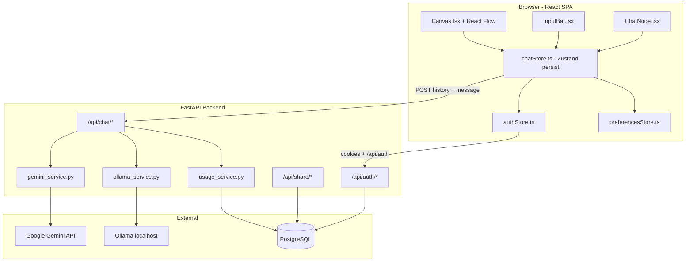
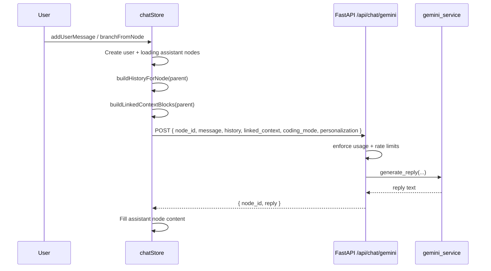

# BranchChat

BranchChat (repository: `branchwise-chat-2`) is a **visual branching chat application**. Users explore ideas in a **tree-shaped conversation** on an infinite canvas instead of a single linear thread. Each branch is an alternate path from any prior message; branches can be tagged, compared, linked for cross-branch context, exported, and shared.

This document is written for **human developers and AI assistants** who need to understand purpose, architecture, data flow, and where to change behavior without reading the entire codebase first.

For backend-only API tables and migration notes, see [`README_BACKEND.md`](README_BACKEND.md).

---

## Purpose and product mental model

### What problem it solves

Linear chat UIs (one scrollback) make it hard to:

- Explore multiple answers or strategies in parallel
- Return to an earlier decision point without losing other threads
- Keep unrelated tangents from polluting the main thread

BranchChat treats a conversation as a **directed tree of messages** rendered as **nodes on a canvas** (React Flow). The user selects a node, continues linearly, or **branches** to try a different direction while keeping siblings visible.

### Core user actions

| Action | Meaning |
|--------|---------|
| **Continue** | Append a user message and request an assistant reply on the **current path** (child of the selected node). |
| **Branch** | Same as continue, but explicitly from a **non-leaf** node—creates a **sibling** subtree (alternate timeline). |
| **Focus branch** | Branch with optional `focusText` (excerpt); the prompt tells the model to emphasize that excerpt. |
| **Link context** | Drag from a node’s green handle to another branch; the target node’s future replies can include **linked branch history** as supplemental context (not as instructions). |
| **Compare** | Pick two branch endpoints and view them side by side (`BranchCompare`). |
| **Tag / color / comment** | Organize nodes locally (metadata on `ChatNode`). |
| **Summarize branch** | Call backend to generate a short AI summary stored on the node. |
| **Share branch** | Authenticated users create a **read-only snapshot URL** stored in Postgres. |
| **Export** | JSON dump of session state and/or PDF of a thread. |

### What BranchChat is not

- **Not** a real-time multi-user editor: collaboration is via **share links**, not live cursors.
- **Not** a server-authoritative chat log for the main UI: the **canonical conversation tree lives in the browser** (Zustand + `localStorage`). The backend powers **AI**, **auth**, **usage limits**, **sharing**, and optional legacy DB-tree APIs.

---

## High-level architecture



### Repository layout (mental map)

| Path | Role |
|------|------|
| `src/` | React frontend: pages, canvas, stores, types |
| `src/store/chatStore.ts` | **Primary application logic** for trees, AI calls, branching, context links |
| `src/components/Canvas.tsx` | React Flow canvas, layout, replay, import/export UI |
| `src/components/ChatNode.tsx` | Per-node UI (handles, menus, resize, branch actions) |
| `src/types/chat.ts` | `ChatNode`, `ChatSessionState`, workspaces |
| `app/` | FastAPI application |
| `app/main.py` | App factory, middleware (CORS, rate limits, host allowlist) |
| `app/routers/chat.py` | Gemini/Ollama/summarize endpoints used by the UI |
| `app/services/gemini_service.py` | Prompt assembly, Gemini HTTP, model fallback |
| `app/services/usage_service.py` | Daily quotas (anon vs authenticated, code mode) |
| `alembic/` | Database migrations |
| `tests/` | Pytest for auth, security, Gemini fallback, guardrails |

---

## Data model (frontend — source of truth for the UI)

All active conversation state is in **`chatStore`** (Zustand), persisted under the key `branchchat-storage` in `localStorage`.

### `ChatNode`

Defined in `src/types/chat.ts`. Each node is one message in the tree.

```ts
interface ChatNode {
  id: string;                    // client-generated, e.g. node_1739...
  parentId: string | null;       // tree edge (null = root)
  role: 'system' | 'user' | 'assistant';
  content: string;
  childrenIds: string[];         // ordered child list
  contextNodeIds?: string[];     // cross-branch links (see below)
  branchLabel?: string;
  branchColor?: string;          // hex from BRANCH_SWATCH_COLORS
  branchSummary?: string;        // AI-generated via /api/chat/summarize-branch
  tags?: string[];
  comments?: NodeComment[];
  focusText?: string;            // branch-with-focus excerpt
  codingMode?: boolean;
  isLoading?: boolean;
  position?: { x: number; y: number };
  width?: number;
  height?: number;
  createdAt: number;
}
```

### `ChatSessionState`

One tab/session in the UI (user can have multiple chats):

- `nodes`, `rootId`, `selectedNodeId`, `activePath` (path from root to selection)
- `title`, `workspace` (`personal`, `research`, `coding-interview-prep`, etc.)
- `collapsedNodeIds`, `journalEntries` (research journal audit log)

### Tree invariants

- Exactly one **root** (`id: 'root'`, `role: 'system'`, welcome text).
- **Parent/child** is authoritative for “thread to root.”
- **`contextNodeIds`** are **orthogonal edges**: they do not change parent/child layout but inject **linked context** into AI requests for descendants of the target node.
- Cycle prevention for context links: no ancestor/descendant links, no duplicate links, max **4** linked branches per target (`MAX_CONTEXT_BRANCH_LINKS`).

### Context linking algorithm (summary)

When building a reply for node `N`:

1. Walk ancestors of `N`; collect `contextNodeIds` from each ancestor (up to 4 sources).
2. For each source branch, take messages on the path from that source’s root **excluding** nodes already on `N`’s ancestry (avoid double-counting).
3. Package as `linked_context[]` with `source_node_id`, `source_label`, and `messages[]`.
4. Send to backend separately from `history` (path-to-parent thread).

Implementation: `buildLinkedContextBlocks`, `buildHistoryForNode` in `src/store/chatStore.ts`.

---

## AI request flow (end-to-end)

This is the **primary integration path** used in production (`ENABLE_LEGACY_TREE_API=false`).



### Provider selection

- `VITE_PROVIDER=gemini` (default) → `POST {VITE_API_BASE}/api/chat/gemini`
- `VITE_PROVIDER=ollama` → `POST {VITE_API_BASE}/api/chat/ollama`

### Request body (client → server)

| Field | Purpose |
|-------|---------|
| `node_id` | Opaque client id (echoed in response; **not** used to load DB tree on Gemini/Ollama routes) |
| `message` | Latest user prompt |
| `history` | Truncated list of `{role, content}` from path to parent |
| `linked_context` | Up to 4 blocks of supplemental branch transcripts |
| `coding_mode` | Wider limits + coding system appendix on server |
| `personalization` | Optional string from `preferencesStore` (“about user”, “response style”) |

### History truncation (client)

| Mode | Max messages | Max chars |
|------|--------------|-----------|
| Standard | 20 | 24,000 |
| Coding | 28 | 48,000 |

Message length caps: 5,000 (standard) / 10,000 (coding) characters per send.

### Server-side prompt assembly (`gemini_service.py`)

- Base policy: `DEFAULT_SYSTEM_INSTRUCTION` (shared with Ollama path).
- Appends: coding appendix, linked-context rules, personalization, then formats linked blocks as labeled transcript sections.
- **Linked context is supplemental**, not overriding active branch history.
- **Model fallback**: primary `GEMINI_MODEL`, on rate-limit, timeout, or upstream 5xx errors retries `GEMINI_FALLBACK_MODEL`.
- **Output guardrails**: `reply_guardrails.sanitize_branching_reply` before returning text.

### Other AI endpoints

| Endpoint | Use |
|----------|-----|
| `POST /api/chat/summarize` | Auto chat title from first messages |
| `POST /api/chat/summarize-branch` | Per-node branch summary (UI menu) |

Both count against the same daily usage limits as chat.

### Legacy server-persisted tree (disabled by default)

When `ENABLE_LEGACY_TREE_API=true`, these store messages in Postgres and reconstruct paths server-side:

- `POST /api/chat`, `POST /api/chat/stream`
- `POST /api/conversation/start`, tree/node routers

The **shipping frontend does not depend on this**; it keeps the tree locally and only posts **stateless** completion payloads to `/api/chat/gemini` or `/api/chat/ollama`.

---

## Frontend architecture

### Entry and routing (`src/App.tsx`)

| Route | Page | Purpose |
|-------|------|---------|
| `/` | `Index` → `Canvas` | Main branching chat UI |
| `/login`, `/signup`, `/verify-email`, `/forgot-password`, `/reset-password` | Auth flows |
| `/upgrade` | Upgrade / limits messaging |
| `/analytics` | Traffic analytics dashboard (backend-fed) |
| `/shared/:token` | Read-only shared branch viewer |
| `/privacy` | Privacy Policy page |
| `/terms` | Terms of Service page |

### State stores

| Store | Persistence | Responsibility |
|-------|-------------|----------------|
| `chatStore` | `localStorage` (`branchchat-storage`) | Trees, multi-chat, AI calls, compare, journal |
| `authStore` | Session via HTTP-only cookies | User, usage quota display |
| `preferencesStore` | `localStorage` | Personalization strings sent to AI |
| `analyticsStore` | In-memory | Analytics page data |

### Key UI components

- **`Canvas.tsx`**: React Flow graph; converts `ChatNode` records to flow nodes/edges; auto-layout (`computeTreeLayout`); history replay; coding mode toggle; import/export JSON; PDF export hook.
- **`ChatNode.tsx`**: Node chrome—branch, retry, tag, share, summarize, compare, context handles (green), resize, collapse.
- **`InputBar.tsx`**: Sends `addUserMessage` against `selectedNodeId`.
- **`Toolbar.tsx`**: Chat list, workspace, new chat, settings entry.
- **`BranchCompare.tsx`**: Side-by-side branch diff when compare mode active.
- **`ResearchJournal.tsx`**: Timeline of branch/tag/compare/note events.
- **`RichText.tsx`**: Markdown + math (KaTeX) rendering for assistant content.

### Analytics & privacy (PostHog)

- **PostHog** product analytics + session replay, initialized in `src/main.tsx`. Keys come from `VITE_PUBLIC_POSTHOG_KEY` / `VITE_PUBLIC_POSTHOG_HOST` (US cloud).
- **Consent-gated**: PostHog inits with `opt_out_capturing_by_default: true`, so nothing is captured or recorded until the visitor accepts in the cookie banner (`src/components/CookieConsent.tsx`). The choice persists in `localStorage` (`src/lib/consent.ts`); the footer "Cookie settings" link re-opens the banner so consent can be withdrawn.
- **SPA pageviews** are automatic via `defaults: '2026-01-30'` (`capture_pageview: 'history_change'`) — do **not** add manual react-router pageview capture (it double-counts).
- **Per-route session-replay masking**: the `/app` chat workspace is wrapped in `.ph-mask` (`AppChat.tsx`); `main.tsx` masks all text + input values inside it, so conversation content is never recorded, while the public landing stays visible. Project-level masking baseline = "mask only passwords".
- **Legal pages**: `/privacy` + `/terms` (`src/pages/Privacy.tsx`, `Terms.tsx`) share `src/components/legal/LegalLayout.tsx`; company/contact/jurisdiction constants live in `src/lib/legal.ts`. Copy is a template draft — have it reviewed before launch.
- **Reverse proxy**: in production PostHog is routed through `https://t.branch-chat.com` (PostHog Managed reverse proxy + a `t` CNAME in Cloudflare DNS, gray-cloud / DNS-only) to dodge ad-blockers. Set `VITE_PUBLIC_POSTHOG_HOST` to the proxy in prod, or `https://us.i.posthog.com` for direct.

### Continuing vs branching (implementation)

Both ultimately call `requestProviderReply(parentId, message, history, { linkedContext, codingMode })`:

- **`addUserMessage`**: Parent = `selectedNodeId` (or explicit `parentId`). Linear continuation.
- **`branchFromNode`**: Parent = chosen node; sets `branchLabel` / optional `focusText`; appends focus clause to prompt via `buildPromptMessage`.

Each successful exchange creates **two nodes**: `user` then `assistant` (assistant may show `isLoading` until fetch completes).

---

## Backend architecture

### Stack

- **FastAPI** + **Uvicorn**
- **SQLAlchemy async** + **Alembic** (Postgres in production; SQLite possible for local dev)
- **JWT** in HTTP-only cookie (`branchchat_token`)
- **Anonymous session** cookie (`branchchat_anon_id`) for quota attribution without login

### Middleware and security (`app/main.py`)

- Global and per-route **rate limits** (IP / client id buckets).
- **CORS** allowlist + dev localhost regex.
- **Host header** allowlist when `ALLOWED_HOSTS` set.
- **Origin check** on state-changing methods (CSRF-oriented).
- Security headers on responses (`X-Content-Type-Options`, `X-Frame-Options`, etc.).
- Auto **Alembic upgrade** on startup in `ENV=development` only.

### Usage limits (`usage_service.py`)

| Actor | Typical daily AI message budget | Notes |
|-------|----------------------------------|-------|
| Anonymous | `FREE_DAILY_MESSAGE_LIMIT` (default **10**) | Also network-level bucket via `ANONYMOUS_NETWORK_BUCKET_MULTIPLIER` |
| Authenticated + verified email | `AUTHENTICATED_DAILY_MESSAGE_LIMIT` (default **50**) | |
| Authenticated coding mode | `AUTHENTICATED_CODE_DAILY_MESSAGE_LIMIT` (default **10**) | Separate counter from standard messages |

Exceeded limits → HTTP **429** with human-readable `detail`; frontend sets `authLimitReached` for anonymous users.

Anonymous identity is a **HMAC-derived opaque id** (not raw IP stored) using `ANON_IDENTITY_SALT`.

### Auth endpoints

- `POST /api/auth/signup`, `login`, `logout`
- `GET /api/auth/me`
- Email verification and password reset (Resend when configured)

### Share endpoints

- `POST /api/share` (auth required): stores JSON message list + token
- `GET /api/share/{token}`: public read, respects `SHARE_LINK_TTL_DAYS`

---

## Environment variables (quick reference)

### Backend (`.env`)

See [`.env.example`](.env.example). Critical groups:

- **Database**: `DATABASE_URL`, `ENV`
- **AI**: `GEMINI_API_KEY`, `GEMINI_MODEL`, `GEMINI_FALLBACK_MODEL`, `OLLAMA_URL`, `OLLAMA_MODEL`
- **Auth / limits**: `JWT_SECRET_KEY`, `ANON_IDENTITY_SALT`, `FREE_DAILY_MESSAGE_LIMIT`, `AUTHENTICATED_DAILY_MESSAGE_LIMIT`, `AUTHENTICATED_CODE_DAILY_MESSAGE_LIMIT`
- **Production hardening**: `CORS_ORIGINS`, `ALLOWED_HOSTS`, `COOKIE_SECURE`, `COOKIE_SAMESITE`, `ENABLE_LEGACY_TREE_API=false`

### Frontend (build-time `VITE_*`)

- `VITE_API_BASE` — backend origin (e.g. `http://localhost:8000`)
- `VITE_PROVIDER` — `gemini` or `ollama`
- `VITE_*_DAILY_MESSAGE_LIMIT` — display mirrors for UI copy
- `VITE_PUBLIC_POSTHOG_KEY` — PostHog public project key (client-side; safe to expose)
- `VITE_PUBLIC_POSTHOG_HOST` — PostHog host; reverse proxy `https://t.branch-chat.com` in prod, `https://us.i.posthog.com` direct

API keys **never** appear in frontend env; only the backend calls Gemini/Ollama.

---

## Local development

### Prerequisites

- Node 18+ and `npm install`
- Python 3.11+ venv and `pip install -r requirements.txt`
- Postgres (or dev SQLite if configured in `DATABASE_URL`)

### Gemini (default cloud provider)

```sh
# .env (backend) and/or frontend .env
GEMINI_API_KEY=your_google_ai_studio_key
GEMINI_MODEL=gemini-2.5-flash
GEMINI_FALLBACK_MODEL=gemini-2.0-flash
VITE_PROVIDER=gemini
VITE_API_BASE=http://localhost:8000
```

```sh
# Terminal 1 — backend
.\.venv\Scripts\python.exe -m uvicorn app.main:app --reload --host 127.0.0.1 --port 8000

# Terminal 2 — frontend
npm run dev
```

Primary UI endpoint: `POST http://localhost:8000/api/chat/gemini`

### Ollama (optional local models)

```sh
ollama pull llama3.1:8b
# Set VITE_PROVIDER=ollama in frontend env
```

Endpoint: `POST http://localhost:8000/api/chat/ollama`

### Optional auth limits (backend `.env`)

```sh
JWT_SECRET_KEY=replace-with-strong-secret
JWT_EXPIRE_MINUTES=60
COOKIE_SECURE=false
FREE_DAILY_MESSAGE_LIMIT=10
AUTHENTICATED_DAILY_MESSAGE_LIMIT=50
```

Auth: `POST /api/auth/signup`, `login`, `logout`, `GET /api/auth/me` — limits return **429** when exceeded.

### Tests

```sh
# Frontend unit tests
npm test

# Backend pytest
.\.venv\Scripts\python.exe -m pytest
```

---

## Production deployment (summary)

Recommended split:

- **Frontend**: Cloudflare Pages (`npm run build` → `dist/`, `public/_redirects` for SPA routing)
- **Backend**: Railway (root `Dockerfile`, `railway.json`, healthcheck `/health`)
- **Database**: Railway Postgres or Neon

### Railway backend env (essentials)

```sh
DATABASE_URL=postgresql+asyncpg://...
GEMINI_API_KEY=your_key
GEMINI_MODEL=gemini-2.5-flash
GEMINI_FALLBACK_MODEL=gemini-2.0-flash
JWT_SECRET_KEY=a-long-random-secret
ANON_IDENTITY_SALT=another-long-random-secret
COOKIE_SECURE=true
COOKIE_SAMESITE=none
CORS_ORIGINS=https://your-frontend.pages.dev
ALLOWED_HOSTS=your-api.up.railway.app
ENABLE_LEGACY_TREE_API=false
```

### Cloudflare Pages frontend env

```sh
VITE_API_BASE=https://api.branch-chat.com
VITE_PROVIDER=gemini
VITE_PUBLIC_POSTHOG_KEY=phc_...                       # PostHog public project key
VITE_PUBLIC_POSTHOG_HOST=https://t.branch-chat.com   # reverse proxy (ad-blocker resistant)
```

> Set these in **Cloudflare Pages → Settings → Variables and Secrets** (they are build-time, baked into the bundle). After changing them, retry the latest deployment so the new values take effect.

---

## Launch checklist

- Move production `DATABASE_URL` to Postgres
- Set strong `JWT_SECRET_KEY` and separate `ANON_IDENTITY_SALT`
- Set `COOKIE_SECURE=true` and `COOKIE_SAMESITE=none` for cross-site frontend/API domains
- Update `CORS_ORIGINS` and `ALLOWED_HOSTS` to real domains
- Leave `TRUST_PROXY_FORWARDED_IP=false` unless proxy headers are trusted
- Leave `ENABLE_LEGACY_TREE_API=false` unless migrating old clients
- Keep `dev.db` and `.env` out of deployments
- Review [`docs/launch-rollback-playbook.md`](docs/launch-rollback-playbook.md) before risky releases

---

## Guide for AI assistants modifying this codebase

| If you need to… | Start here |
|-----------------|------------|
| Change branching / tree / context behavior | `src/store/chatStore.ts`, `src/types/chat.ts` |
| Change canvas layout or interactions | `src/components/Canvas.tsx`, `src/components/ChatNode.tsx` |
| Change prompt / model / fallback | `app/services/gemini_service.py`, `app/services/ollama_service.py` |
| Change quotas or 429 messages | `app/services/usage_service.py`, `app/core/config.py` |
| Change API contract | `app/schemas/message.py`, `app/routers/chat.py` |
| Change auth or cookies | `app/routers/auth.py`, `app/services/auth_service.py`, `src/store/authStore.ts` |
| Add DB fields | Alembic migration under `alembic/versions/`, models in `app/models/` |

**Do not assume** the backend stores the visual tree for normal chat: persist changes belong in **`chatStore` persistence** unless you intentionally enable the legacy tree API.

---

## Technologies

**Frontend:** Vite, TypeScript, React 18, React Router, Zustand, TanStack Query, React Flow (`@xyflow/react`), Tailwind, shadcn/ui, Framer Motion, react-markdown + KaTeX.

**Backend:** FastAPI, Uvicorn, SQLAlchemy (async), Alembic, Pydantic v2, httpx (Gemini), pytest.
