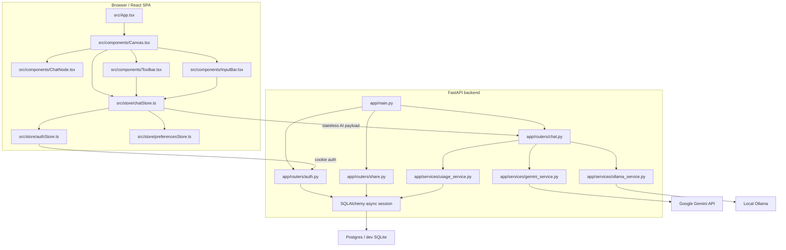

# BranchChat Architecture

This document is a compact handoff map for Claude and future agents. The longer narrative lives in `README.md`; backend-specific API notes live in `README_BACKEND.md`.

## Product Shape

BranchChat is a visual branching chat app. Instead of one linear transcript, each conversation is a tree of message nodes on an infinite React Flow canvas. Users can continue from the selected node, branch from any prior node, compare branch endpoints, tag/comment nodes, link context across branches, replay branch history, export sessions, and share read-only branch snapshots.

The most important architectural fact: the normal product UI is client-authoritative for the conversation tree. The backend does not own the active visual tree for ordinary chat. It provides AI responses, auth, quotas, sharing, analytics, and optional legacy tree endpoints.

## Runtime Topology



## Frontend Source Of Truth

Conversation state lives in Zustand in `src/store/chatStore.ts`, persisted to localStorage under `branchchat-storage`.

Core types are in `src/types/chat.ts`:

- `ChatNode`: one message node with `id`, `parentId`, `role`, `content`, `childrenIds`, position/size, tags, comments, branch metadata, and optional `contextNodeIds`.
- `ChatSessionState`: one chat tab/workspace with `nodes`, `rootId`, `selectedNodeId`, `activePath`, `collapsedNodeIds`, title, workspace, and journal entries.

Tree invariants:

- `parentId` and `childrenIds` define the real conversation tree.
- `activePath` is the path from root to the current selected node.
- `contextNodeIds` are cross-branch supplemental context links. They are not parent-child edges.
- Normal chats start with a `root` system node.

## Primary Frontend Files

| File | Responsibility |
| --- | --- |
| `src/store/chatStore.ts` | Main behavior: create chats, continue, branch, retry, link context, compare, tag, summarize, share, import/export, layout helpers. |
| `src/components/Canvas.tsx` | React Flow graph, visible nodes/edges, canvas controls, replay, fit/focus behavior, import/export controls. |
| `src/components/ChatNode.tsx` | Node chrome, menu actions, branch/continue buttons, resize, handles, tags/comments. |
| `src/components/Toolbar.tsx` | Workspace browser, chat management, search, prompt/tag result navigation. |
| `src/components/InputBar.tsx` | Composer and prompt length handling. |
| `src/components/BranchCompare.tsx` | Side-by-side branch comparison. |
| `src/components/ResearchJournal.tsx` | Local activity/journal panel. |
| `src/store/authStore.ts` | Auth user and quota status. |
| `src/store/preferencesStore.ts` | Local personalization text sent with AI requests. |

## AI Flow

For the current shipping UI:

1. User sends a message or branches from a node.
2. `chatStore.ts` immediately creates a user node and loading assistant node.
3. It builds `history` from the selected path and `linked_context` from context-linked branches.
4. It posts to `/api/chat/gemini` or `/api/chat/ollama` depending on `VITE_PROVIDER`.
5. Backend enforces rate limits and usage limits, assembles the model prompt, calls provider, sanitizes the reply, and returns text.
6. `chatStore.ts` fills the loading assistant node and updates selection/path.

Important: `node_id` in stateless chat routes is mostly an echo/correlation id. The backend should not assume it can load the UI tree from Postgres for normal chat.

## Backend Shape

FastAPI app entry is `app/main.py`.

Middleware responsibilities:

- CORS allowlist plus localhost dev support.
- Host header allowlist when configured.
- Global API and AI-specific in-memory rate limits.
- Origin checks for state-changing browser requests.
- Security headers and no-store headers for auth routes.
- Dev-only Alembic auto-upgrade on startup.

Key routers:

- `app/routers/chat.py`: stateless Gemini/Ollama chat endpoints, summarization, legacy chat routes.
- `app/routers/auth.py`: signup, login, logout, `/me`, usage status, verification, password reset.
- `app/routers/share.py`: authenticated branch snapshot creation and public share reads.
- `app/routers/analytics.py`: analytics dashboard endpoints.
- `app/routers/conversation.py` and `app/routers/node.py`: legacy server-persisted tree API, disabled unless configured.

Key services:

- `app/services/gemini_service.py`: Gemini HTTP calls, fallback model behavior, prompt assembly, linked context formatting.
- `app/services/ollama_service.py`: local model path.
- `app/services/usage_service.py`: anonymous/authenticated daily quotas and network abuse buckets.
- `app/services/auth_service.py`: password hashing, JWT cookies, anonymous cookies, email token helpers, failed login limiter.
- `app/services/share_service.py`: share snapshot persistence.
- `app/services/tree_service.py`: legacy tree path and deletion helpers.

## Persistence

Frontend:

- `localStorage` key `branchchat-storage` stores chats, active chat id, and coding mode.
- This is the canonical state for ordinary user conversations.

Backend:

- Postgres in production, SQLite can be used locally.
- Alembic migrations live in `alembic/versions`.
- Auth users, email tokens, usage events, analytics rows, share snapshots, and legacy message trees are backend persisted.

## Deployment Model

Recommended split from the README:

- Frontend: Cloudflare Pages from `npm run build` output in `dist/`.
- Backend: Railway using root `Dockerfile` and `railway.json`.
- Database: Railway Postgres or Neon.

Critical production env:

- Backend: `DATABASE_URL`, `GEMINI_API_KEY`, `GEMINI_MODEL`, `GEMINI_FALLBACK_MODEL`, `JWT_SECRET_KEY`, `ANON_IDENTITY_SALT`, `COOKIE_SECURE=true`, `COOKIE_SAMESITE=none`, `CORS_ORIGINS`, `ALLOWED_HOSTS`, `ENABLE_LEGACY_TREE_API=false`.
- Frontend: `VITE_API_BASE`, `VITE_PROVIDER`.

## Recent Context For The Handoff

Recent work already pushed to `main`:

- Gemini 504/upstream fallback hardening.
- Branch node placement fixes so new nodes stay centered when possible and avoid overlap when occupied space exists.
- Auth rate-limit fix: removed the duplicate broad `/api/auth/*` middleware bucket while keeping route-specific auth limits.
- Search UX fix: prompt results show fuller context and clicking a prompt/tag result switches chat, selects the exact node, expands ancestors, and centers the node.

## High-Risk Areas

- `src/store/chatStore.ts` is large and owns many behaviors. Keep changes narrow and test tree/layout helpers when changing it.
- React Flow viewport behavior is timing-sensitive. For focus/fit changes, verify in browser, not only with unit tests.
- Rate limits are layered: global API middleware, AI middleware, route-specific auth checks, usage quotas, and failed-login throttling.
- Backend README has some older OpenAI wording. The current launch path is Gemini-first with Ollama optional; follow `README.md` and actual code when conflicts appear.
- Do not expose AI provider keys in Vite env. Keys belong only in backend env.

## Verification Commands

```powershell
npm.cmd test
npm.cmd run build
npm.cmd run lint
.\.venv\Scripts\python.exe -m unittest discover tests
```

Known lint state: `npm.cmd run lint` may pass with existing `react-refresh/only-export-components` warnings in shadcn/ui files.
